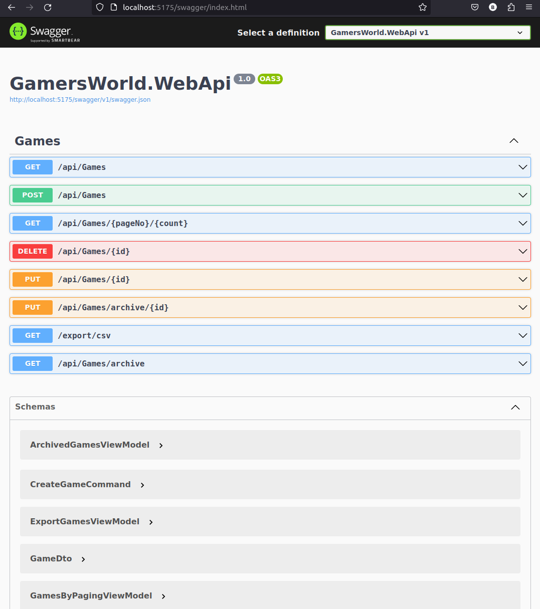

# Clean Architecture 101

Uygulamalı clean architecture eğitimi için hazırlanmış baz repodur.

- [Clean Architecture 101](#clean-architecture-101)
  - [Ön Hazırlıklar](#ön-hazırlıklar)
  - [Çalışma Zamanı](#çalışma-zamanı)
  - [Gelen Çözüm İskeleti](#gelen-çözüm-i̇skeleti)
  - [Nasıl Çalışmalı?](#nasıl-çalışmalı)

## Ön Hazırlıklar

Örnekte şu an için sqlite tabanlı fiziki bir veritabanı dosyası kullanılmakta. Migration işlemleri için web api uygulaması ayaktayken Data projesi altında aşağıdaki komutları çalıştırmak yeterli.

```bash
# Migration planını hazırlamak için
dotnet ef migrations add InitialCreate --startup-project ../../presentation/GamersWorld.WebApi

# Database'i oluşturmak için
dotnet ef database update --startup-project ../../presentation/GamersWorld.WebApi
```

## Çalışma Zamanı

Uygulamanın son kullanıcı ile temas noktası web api örneğidir. WebApi klasöründeyken proje aşağıdaki komutla çalıştırılabilir.

```bash
dotnet run
```

Postman için örnek komutları [şuradaki dosyadan](Clean%20Architecture%20Training.postman_collection.json) alabilirsiniz.

## Gelen Çözüm İskeleti

Bu mimarinin uygulanmasında aşağıdakine benzer bir solution yapısı kullanılabilir.

```text
root
├── src
│   ├── core
│   │   ├── Application
│   │   └── Domain
│   ├── infrastructure
│   │   ├── Data
│   │   └── Shared
│   └── presentation
│       └── WebApi
└── tests
    ├── core
    │   ├── Application.Tests
    │   └── Domain.Tests
    ├── infrastructure
    │   ├── Data.Tests
    │   └── Shared.Tests
    └── presentation
        └── WebApi.Tests
```

## Nasıl Çalışmalı?

Repodaki base branch'ten yeni bir branch çıkılıp geliştirmeler bunun üzerinde yapılabilir. base branch'te solution'ın genel iskeleti kuruludur ve ihtiyaç duyulacak pek çok sınıf dosyası içi boş olacak şekilde hazıdır. Eğitim sırasında bu içerik hazırlanarak ilerlenir. Yapılması gereken değişiklikler için main branch'te yer alan kodun son haline bakılabilir.

Swagger dokümantasyonu için localhost:5175/swagger/index.html adresine gidilebilir.


